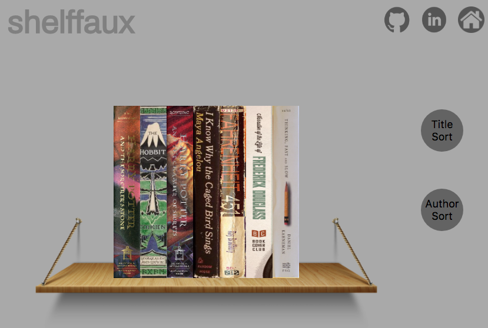
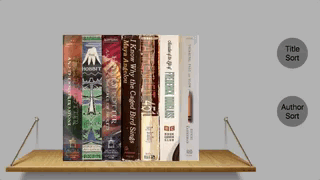

# [shelffaux](https://cfritsch5.github.io/shelffaux/)

*The personal library visualization site*

People are increasingly moving to digital books, however what we keep on our bookshelves says a lot about who we are and have been a longstanding aesthetic piece in many rooms. Shelffaux introduces a way to visually recreate the home library as an interactive digital display.

There are several library and book review and management sites, GoodReads being a primary example, however none of the available sites offer a visually appealing way to display your books, and they are no replacement for the interest that a bookshelf holds.

## Featuring

###  Interactive 3-D books

Books are animated as the user browses books by mousing a cross the shelf, and turn to display their front covers

*Books move as the user mouses over them to display the front covers*

### Visualize Sorting

Books can alphabetically sorted by title or author by an implementation of bubble sort, and each step in the is displayed as each pair of books switch.

*Books are sorted by author last name*

*Books are sorted by title*
