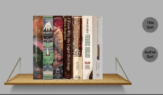

# [shelffaux](https://cfritsch5.github.io/shelffaux/)


*The personal library visualization site*

People are increasingly moving to digital books, however what we keep on our bookshelves says a lot about who we are and have been a longstanding aesthetic piece in many rooms. Shelffaux introduces a way to visually recreate the home library as an interactive digital display.

There are several library and book review and management sites, GoodReads being a primary example, however none of the available sites offer a visually appealing way to display your books, and they are no replacement for the interest that a bookshelf holds.

## Featuring

###  Interactive 3-D books

Books are animated as the user browses books by mousing a cross the shelf, and turn to display their front covers


*Books move as the user mouses over them to display the front covers*

### Visualize Sorting

Books can alphabetically sorted by title or author by an implementation of bubble sort, and each step in the is displayed as each pair of books switch.


*Books are sorted by author last name*



*Books are sorted by title*

## Implementation Highlights

Build with only JavaScript and HTML canvas the 3-D cover image is created by sampling the original image and scaling each slice proportionally to display the image in perspective.

```javascript
//inside the book draw cover method
let sample = Math.floor(img.width / coverWidth);
for ( let i = 0 ; i < coverWidth; i++){
  sx += sample;
  y += deltaY;
  height -= deltaY * 2;
  ctx.drawImage(img,sx,sy,swidth,sheight,x,y,width,height);
  x += 1;
}
```

The canvas updates on mouse movement and redraws only the affected area's of the image to improve performance.  The books are then dynamically rendered based on the mouse position.

```javascript
function draw(x, y) {
  x -= canvas.getBoundingClientRect().left;

  let bound = bookWidth * 2;
  ctx.clearRect(x-bound, 0, x+bound, canvas.height);

  let book, position = bookWidth;
  for(let i = 0 ; i < books.length; i++ ) {
    books[i].leftBorder = position;
    position +=  bookWidth;
    books[i].rightBorder = position;
    book = books[i];
    book.draw(ctx, x, y);
  }
}
```

## Future Features

- [ ] User can add their own books
- [ ] User can upload images
- [ ] Pull users bookshelf from GoodReads
- [ ] Pull cover images from Amazon 
