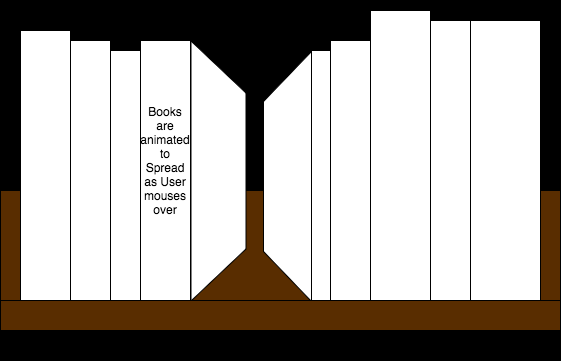
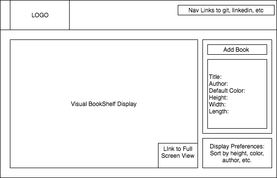

## Shelfaux
The personal library visualization site

### Description
People are increasingly moving to digital books, however what we keep on our bookshelves says a lot about who we are and have been a longstanding aesthetic piece in many rooms. Shelffaux introduces a way to visually recreate the home library in poster form or for interactive digital display.

There are several library and book review and management sites, GoodReads being a primary example, however none of the available sites offer a visually appealing way to display your books, and they are no replacement for the interest that a bookshelf holds.

### MVP  

Shelffaux will

- [ ] Visually recreate an interactive bookshelf
- [ ] Browse through books on the shelf the same way one would physically.
 Books are displayed by spine, not front cover, and as a user browses over
  them (mousing over, or swiping on touch screen) books are animated to allow
   the user to peak at the front and back covers.
- [ ] Sorting Algorithms to display books in different orders

### Wireframes

### Architecture and Technologies

This project will be implemented with the following technologies:

- Vanilla JavaScript & HTML canvas

### Timeline

**Day 1**: Setup basic structure including base html and script skeletons
**Day 2**:
**Day 3**:
**Day 4**:

### Bonus features

- [ ] Use Amazon and/or GoodReads Api to pull Cover Photo's
- [ ] Add User interface for others to make their own shelves
- [ ] Auto pull a user's GoodReads or Amazon bookshelves
